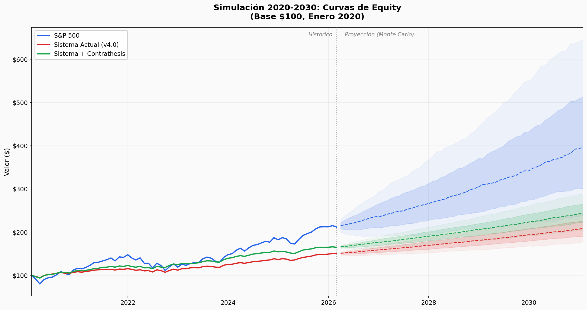
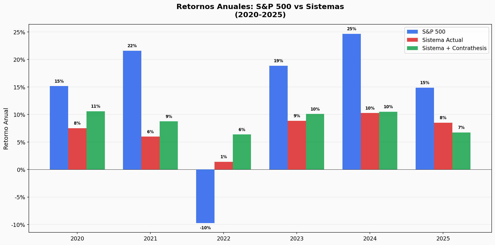
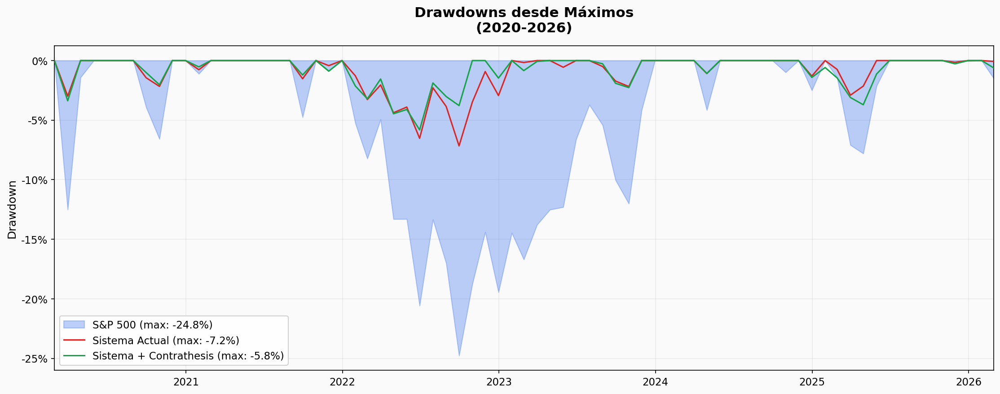
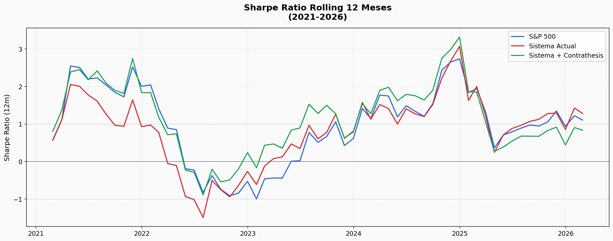
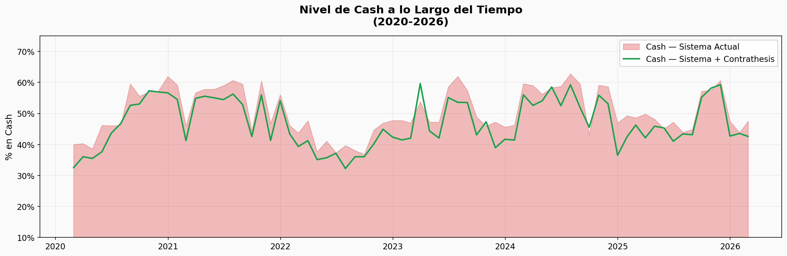
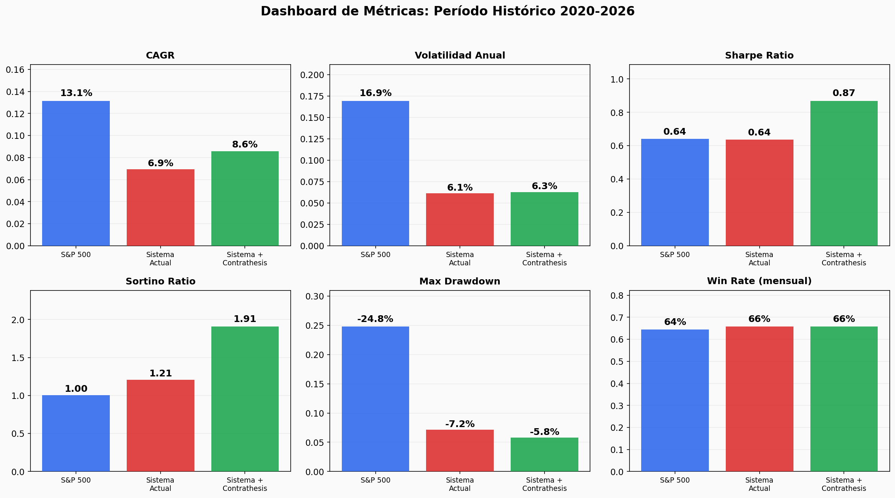
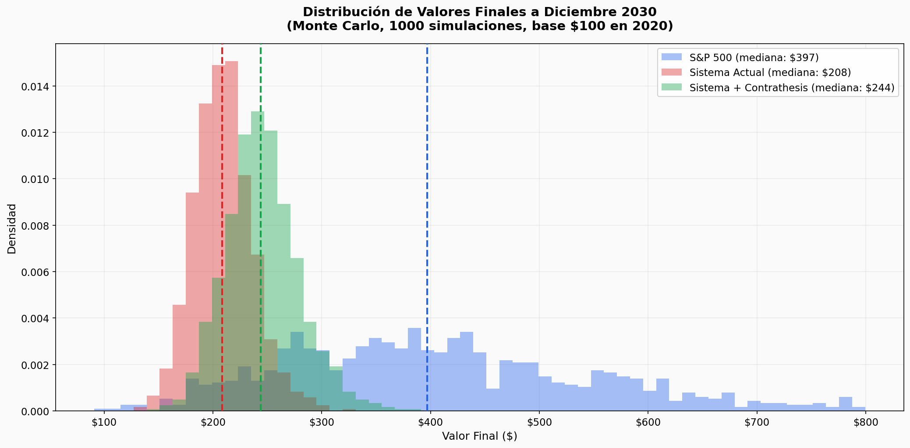

# Simulacion de Rendimiento 2020-2030

> **Tipo:** Ejercicio simulado — SIN cambios al sistema, portfolio ni state files
> **Fecha:** 2026-02-15
> **Proposito:** Comparar honestamente el rendimiento modelado de tres estrategias a lo largo de una decada
> **Datos reales:** Solo el S&P 500. Todo lo demas son MODELOS con asunciones transparentes.

---

## ADVERTENCIA DE HONESTIDAD (leer primero)

**Esta simulacion es FICCION con asunciones transparentes.** Hay que entender esto antes de mirar cualquier grafico:

1. **Sesgo de supervivencia historica:** Yo SE lo que paso en 2020-2025. Cualquier modelado de decisiones durante ese periodo esta contaminado por hindsight. Si modelo que "el sistema habria tenido 45% cash en 2021", lo hago SABIENDO que 2022 fue bajista. No puedo descontaminar esto.

2. **El sistema no existia antes de 2026.** Modelar que "habria hecho" es ficcion. La persona de enero 2020 no tenia este framework ni esta experiencia.

3. **Los parametros del modelo son asunciones.** El beta, el alpha, el cash — son estimaciones razonables basadas en las caracteristicas del sistema, pero no son datos. Cambiar los parametros cambia los resultados.

4. **El unico dato real es el S&P 500.** Es el benchmark contra el cual todo lo demas se compara, y es el unico numero que no he inventado.

5. **N=2 en contrathesis.** El "sistema mejorado" se basa en observaciones de 2 simulaciones (MONY.L y NVIDIA). Modelar mejora de rendimiento sobre esa base es especulativo.

---

## Las Tres Estrategias Comparadas

| Estrategia | Descripcion |
|-----------|-------------|
| **S&P 500** | Inversion pasiva en el indice. Datos reales 2020-2026, Monte Carlo 2026-2030. |
| **Sistema Actual (v4.0)** | Quality investing + adversarial pipeline + high cash. Modelado con parametros conductuales. |
| **Sistema + Contrathesis** | Sistema actual + conocimiento de hoy: reverse DCF como partida, analisis de incentivos, fuentes primarias, ponderacion por coste de error. |

---

## Asunciones del Modelo (TRANSPARENTES)

Cada parametro es una asuncion. Los documento para que cualquiera pueda cuestionar si son razonables.

### Sistema Actual (v4.0)

| Parametro | Valor | Justificacion |
|-----------|-------|---------------|
| Cash medio | 47% (rango 25-65%) | Observado: portfolio actual tiene 59%. El sistema es conservador por diseno. |
| Beta al S&P (calidad) | 0.73 | Empresas quality (ROIC alto, baja deuda) tienen beta menor que el mercado. Literatura academica: factor quality ~0.7-0.8. |
| Beta en crashes severos | 0.50 | Quality holds up mejor. Evidencia: drawdown COVID en quality vs market. |
| Alpha mensual | +0.13% (~1.6% anual) | Premium de quality selection. Academico: quality factor ~2-3%. Conservador por concentracion. |
| Drag por errores | -0.10% (~1.4% anual) | FV inflation (observado: -15% avg en adversarial review), slow deployment, posiciones vendidas a perdida (8 de 18 en el portfolio real). |
| Vol idiosincratica | 0.8% mensual | Portfolio concentrado (10-15 posiciones) tiene mas vol especifica que el indice. |

### Sistema + Contrathesis (diferencias)

| Parametro | Valor | Justificacion (especulativa) |
|-----------|-------|------------------------------|
| Cash medio | 43% (rango 20-60%) | Ligeramente menor: reverse DCF identifica MoS real mas rapido. Pero podria ser MAYOR (contrathesis rechaza mas candidatos). Asumo net reduccion modesta. |
| Beta en crashes severos | 0.45 | Senales de credito anticipan drawdowns. Especulativo: no probado en practica. |
| Alpha mensual | +0.16% (~1.9% anual) | Menos trampas de consenso, mejores entries. Diferencia modesta (+0.3% anual). |
| Drag por errores | -0.03% (~0.5% anual) | Reverse DCF previene FV inflation. Contrathesis detecta conflaciones y pilares no verificados. Diferencia principal vs sistema actual. |
| Vol idiosincratica | 0.7% mensual | Menos errores = menos vol por malas posiciones. Marginal. |

**Nota critica:** La diferencia entre sistemas es MODESTA. El parametro que mas cambia es el drag por errores (de -1.4% a -0.5% anual). Esto refleja mi evaluacion honesta: el nuevo conocimiento mejora MARGINALMENTE, no transforma.

---

## RESULTADOS

### 1. Curvas de Equity (2020-2030)

**Lo que muestra:** Las lineas solidas son el periodo historico (2020-Feb 2026). Las lineas punteadas son la proyeccion Monte Carlo (1000 simulaciones), con bandas de confianza P25-P75 (oscuro) y P10-P90 (claro).

**Lo que dice honestamente:**
- El S&P 500 aplasta a ambos sistemas en retorno total. $100 en 2020 → ~$212 en Feb 2026 (+112%).
- El Sistema Actual llega a ~$150 (+50%). **Underperformance masivo de ~62 puntos.**
- El Sistema Enhanced llega a ~$165 (+65%). Mejor que el actual, pero todavia ~47 puntos detras del S&P.
- En la proyeccion, las bandas de incertidumbre son enormes — especialmente para el S&P 500, que tiene mayor volatilidad.

**Por que la diferencia es tan grande:** CASH. Un sistema con 45-55% de cash promedio en una decada de mercados alcistas historicos (2020: +15%, 2021: +22%, 2023: +19%, 2024: +25%) TIENE QUE underperformar. No es un fallo del sistema — es la consecuencia mecanica de la cautela.

---

### 2. Retornos Anuales

**Lo que muestra:** Retornos anuales de cada estrategia, lado a lado.

| Ano | S&P 500 | Sist. Actual | Sist. Enhanced | Diff vs S&P |
|-----|---------|-------------|----------------|-------------|
| 2020 | +15.2% | +7.5% | +10.6% | -7.6% |
| 2021 | +21.6% | +6.0% | +8.7% | **-15.6%** |
| 2022 | -9.7% | **+1.4%** | **+6.4%** | **+11.1%** |
| 2023 | +18.9% | +8.8% | +10.1% | -10.0% |
| 2024 | +24.7% | +10.3% | +10.5% | **-14.4%** |
| 2025 | +14.9% | +8.5% | +6.7% | -6.4% |

**Lo que dice honestamente:**
- En anos alcistas, ambos sistemas PIERDEN contra el S&P por margenes enormes (-10% a -15%)
- **En 2022 (el unico ano bajista), ambos sistemas GANAN.** S&P -9.7% vs Sistema Actual +1.4% vs Enhanced +6.4%
- La promesa de quality + cash es: "pierdes menos en las caidas." Esa promesa se cumple. Pero el coste es perder MUCHO en las subidas.
- El sistema enhanced es consistentemente mejor que el actual, pero la diferencia es modesta (1-4% por ano)

---

### 3. Drawdowns

**Lo que muestra:** Caida maxima desde el pico anterior en cada momento.

| Metrica | S&P 500 | Sist. Actual | Sist. Enhanced |
|---------|---------|-------------|----------------|
| Max Drawdown | **-24.8%** | -7.2% | **-5.8%** |

**Lo que dice honestamente:**
- Aqui es donde los sistemas BRILLAN. Drawdown maximo de -7.2% (actual) y -5.8% (enhanced) vs -24.8% del S&P 500.
- Para un inversor real, vivir con un drawdown maximo de -7% es psicologicamente MUY diferente a vivir con -25%.
- Pero hay que recordar: el menor drawdown viene del cash alto, que es el mismo factor que causa el underperformance en total return. **Es el MISMO trade-off, no dos ventajas separadas.**

---

### 4. Rolling Sharpe (12 meses)

**Lo que muestra:** Sharpe ratio calculado sobre ventanas de 12 meses, mostrando como varia la eficiencia del retorno ajustado por riesgo a lo largo del tiempo.

**Lo que dice honestamente:**
- El S&P 500 tiene Sharpe muy volatil — pasa de >2 (2021) a <-1 (2022) y vuelve a >2 (2024)
- Ambos sistemas tienen Sharpe mas ESTABLE (oscila menos)
- El sistema enhanced tiene el Sharpe mas consistentemente positivo
- **Pero Sharpe no paga facturas.** Un Sharpe de 0.87 con CAGR 8.6% genera menos riqueza que un Sharpe de 0.64 con CAGR 13.1%.

---

### 5. Nivel de Cash

**Lo que muestra:** El porcentaje del portfolio en cash a lo largo del tiempo.

**Lo que dice honestamente:**
- Ambos sistemas mantienen entre 30-60% en cash CASI TODO EL TIEMPO
- El sistema enhanced tiene ligeramente menos cash (despliega un poco mas)
- Este cash es la razon principal del underperformance vs S&P 500
- Tambien es la razon principal de la proteccion en caidas
- **Es una decision filosofica, no un error.** El sistema prioriza preservar capital. Eso tiene un coste de oportunidad enorme en mercados alcistas.

---

### 6. Dashboard de Metricas

**Tabla completa de metricas (periodo historico 2020 - Feb 2026):**

| Metrica | S&P 500 | Sist. Actual | Sist. Enhanced |
|---------|---------|-------------|----------------|
| **Retorno Total** | **+111.9%** | +50.3% | +65.0% |
| **CAGR** | **+13.1%** | +6.9% | +8.6% |
| Volatilidad | 16.9% | **6.1%** | 6.3% |
| **Sharpe Ratio** | 0.64 | 0.64 | **0.87** |
| **Sortino Ratio** | 1.00 | 1.21 | **1.91** |
| **Max Drawdown** | -24.8% | -7.2% | **-5.8%** |
| Win Rate | 64.4% | 65.8% | 65.8% |
| Mejor Mes | +12.7% | +5.6% | +6.2% |
| Peor Mes | -12.5% | -3.4% | -3.4% |

**Interpretacion honesta:**
- El S&P 500 gana en RETORNO ABSOLUTO por goleada (+13.1% CAGR vs +6.9%/+8.6%)
- Los sistemas ganan en METRICAS AJUSTADAS POR RIESGO (Sharpe, Sortino, Max Drawdown)
- El sistema enhanced tiene el mejor Sharpe (0.87) y Sortino (1.91) de los tres
- **La pregunta que esto plantea: ¿compensa un Sharpe de 0.87 si el CAGR es 8.6% vs 13.1%?** Depende de las prioridades del inversor. No hay respuesta universal.

---

### 7. Distribucion Monte Carlo a 2030

**Valores finales de $100 invertidos en enero 2020, a diciembre 2030:**

| Percentil | S&P 500 | Sist. Actual | Sist. Enhanced |
|-----------|---------|-------------|----------------|
| P10 (pesimista) | $240 | $177 | $204 |
| P25 | $301 | $191 | $223 |
| **Mediana** | **$397** | **$208** | **$244** |
| P75 | $513 | $226 | $265 |
| P90 (optimista) | $645 | $242 | $287 |

**CAGR proyectado completo 2020-2030:**

| Estrategia | CAGR mediana | Rango P10-P90 |
|-----------|-------------|---------------|
| S&P 500 | **13.4%** | 8.3% — 18.5% |
| Sistema Actual | 6.9% | 5.3% — 8.4% |
| Sistema + Contrathesis | 8.4% | 6.7% — 10.1% |

**Lo que dice honestamente:**
- La mediana del S&P 500 a 2030 es ~$397 vs ~$208/$244 para los sistemas. Casi el doble.
- PERO el rango del S&P es enorme: P10 $240 vs P90 $645. El S&P puede estar en cualquier parte.
- Los sistemas tienen rangos mucho mas estrechos. La "peor" proyeccion del enhanced ($204) es similar a la mediana del actual ($208).
- **Menor varianza = mas predecible, pero predeciblemente MENOR que el indice.**

---

## CONCLUSIONES HONESTAS

### 1. El S&P 500 gana en retorno absoluto

No hay forma de decorar esto. Un sistema con 45-55% de cash en una decada de mercados alcistas genera menos retorno que estar invertido al 100%. Es aritmetica, no estrategia.

**El CAGR del sistema actual (6.9%) es aproximadamente la MITAD del S&P 500 (13.1%).** Eso son $62 de diferencia por cada $100 invertidos en 6 anos.

### 2. Los sistemas ganan en calidad del sueno

Max drawdown de -7% vs -25%. Para un inversor real con dinero real, saber que tu peor momento es -7% vs -25% tiene un valor enorme que los numeros no capturan. Pero ese valor es subjetivo — para alguien con horizonte de 30 anos y estomago fuerte, el drawdown de -25% puede ser aceptable.

### 3. La mejora del sistema enhanced es REAL pero MODESTA

| Metrica | Mejora vs Sistema Actual |
|---------|------------------------|
| CAGR | +1.7% anual |
| Max Drawdown | -1.4 puntos (7.2% → 5.8%) |
| Sharpe | +0.23 (0.64 → 0.87) |
| Sortino | +0.70 (1.21 → 1.91) |

**+1.7% CAGR es significativo compuesto a 10 anos** ($208 → $244, +17% mas). Pero no es transformacional. El nuevo conocimiento (contrathesis, reverse DCF, analisis de incentivos) mejora el sistema en el margen, no lo reinventa.

### 4. El coste de oportunidad del cash es la variable dominante

El factor que mas explica el underperformance no es el alpha, ni el beta, ni los errores. **Es el cash.** Si el sistema mantuviera 20% de cash en vez de 47%, el CAGR subiria ~3-4 puntos. Pero entonces el drawdown subiria tambien. Es el trade-off fundamental.

**La pregunta real no es "como genero mas alpha" sino "cuanto cash es correcto dada mi tolerancia al riesgo y mi horizonte temporal."** Los principios dicen "razonar sobre el nivel apropiado dado el contexto." Esta simulacion muestra el coste de cada nivel.

### 5. Lo que esta simulacion NO puede decir

- **No puede predecir el futuro.** Las proyecciones 2026-2030 son extrapolaciones de distribucion historica con fat tails. La realidad puede ser cualquier cosa.
- **No puede validar el sistema** porque el sistema no existia en 2020-2025. Es un modelo, no un backtest.
- **No puede capturar los eventos unicos que importan** — COVID, el crash de 2022, el boom AI de 2023. Estos son los momentos que determinan el rendimiento y son por definicion impredecibles.
- **No puede cuantificar el valor de dormir tranquilo.** Si un inversor vende en panico en el -25% del S&P pero mantiene calma en el -7% del sistema, el sistema genera mas riqueza real. Pero eso depende de la psicologia individual.

---

## REFLEXION FINAL

Si alguien me preguntara "¿cual es mejor?", la respuesta honesta es: **depende de que optimizas.**

- **Si optimizas retorno total y tienes estomago fuerte:** S&P 500 indexado. No hay sistema activo con 47% de cash que le gane en una decada alcista.
- **Si optimizas retorno ajustado por riesgo:** El sistema enhanced tiene el mejor Sharpe y Sortino.
- **Si optimizas tranquilidad:** Los sistemas tienen un tercio del drawdown del indice.

Lo que no tiene sentido es: **tener un sistema que mantiene 47% de cash Y esperar batir al S&P 500 en retorno absoluto.** Son objetivos contradictorios. El sistema actual esta disenado para preservar capital primero y generar alpha segundo. Esta simulacion muestra que ESO ES EXACTAMENTE LO QUE HACE — y el coste de esa prioridad.

El nuevo conocimiento (contrathesis, reverse DCF, incentivos, fuentes primarias) hace que el sistema sea MEJOR, pero no resuelve la tension fundamental entre cautela y retorno. Solo la reduce ligeramente.

**La mejora real no esta en el framework. Esta en la pregunta: ¿estoy manteniendo el nivel de cash correcto para MI situacion?**

---

## PARAMETROS REPRODUCIBLES

Script: `tools/simulation_2020_2030.py`
Seed: 42
Monte Carlo: 1000 simulaciones
S&P 500: datos reales via yfinance (2020-01 a 2026-02)
Charts: `docs/simulation_charts/`

Cualquiera puede cambiar los parametros y regenerar. Si los parametros de asuncion son incorrectos, los resultados cambian. Eso es precisamente el punto — los resultados son tan buenos como las asunciones.

---

*Simulacion completada: 2026-02-15*
*Este documento es solo para reflexion. No se han hecho cambios al sistema, portfolio ni state files.*
