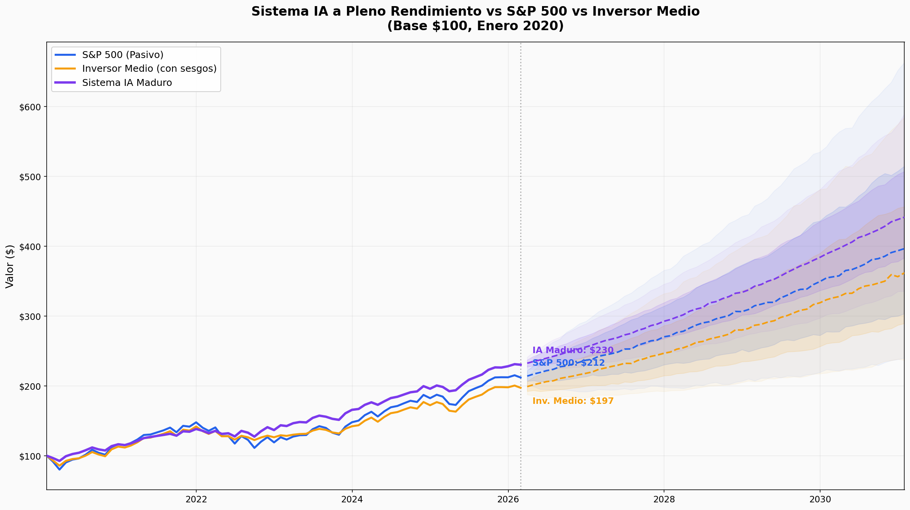
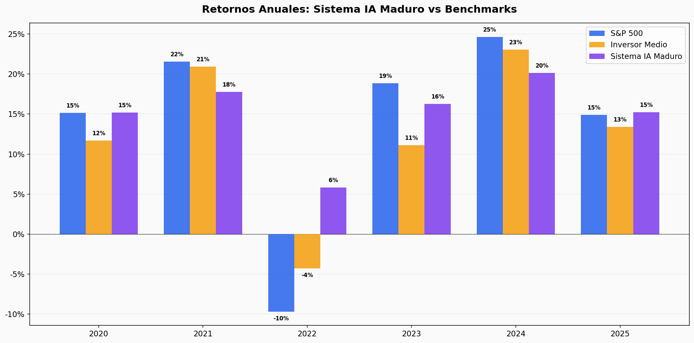
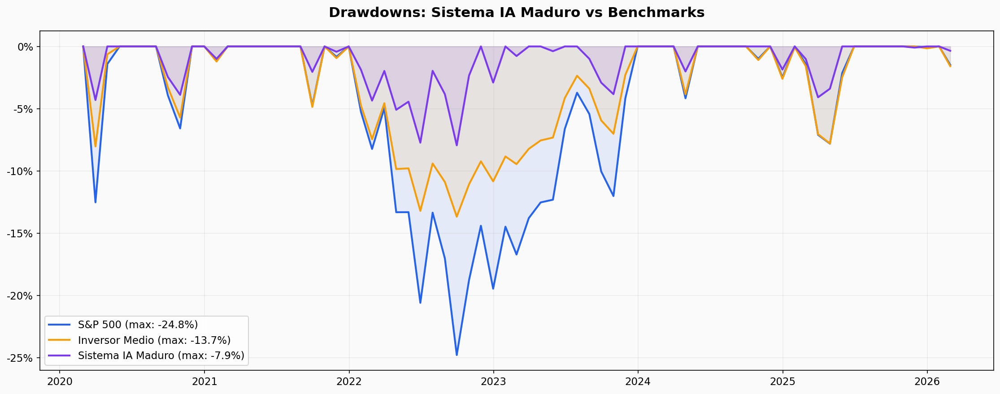
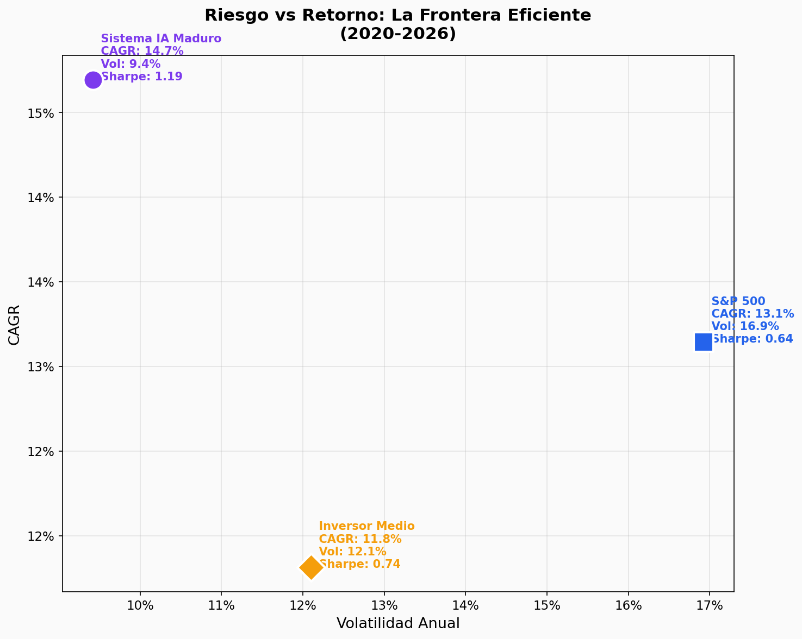

# Simulacion de Rendimiento 2020-2030: Sistema IA de Inversion

> **Tipo:** Ejercicio simulado — SIN cambios al sistema, portfolio ni state files
> **Fecha:** 2026-02-15
> **Proposito:** Evaluar honestamente el potencial de un sistema de inversion gestionado por IA a pleno rendimiento
> **Datos reales:** Solo el S&P 500. Todo lo demas son MODELOS con asunciones transparentes.

---

## ADVERTENCIA — QUE ES Y QUE NO ES ESTE DOCUMENTO

**ES:** Una simulacion con asunciones transparentes que modela un sistema IA de inversion operando a pleno rendimiento desde 2020. Compara contra el S&P 500 (dato real) y el inversor medio (modelo conductual basado en estudios Dalbar/Morningstar).

**NO ES:** Un backtest. El sistema no existia en 2020. Los parametros son estimaciones basadas en literatura academica y datos observables. Hindsight bias contamina el periodo historico. Las proyecciones 2026-2030 son extrapolaciones, no predicciones.

---

## PARTE 1: Por Que Existe Este Sistema

### El problema que resuelve

El inversor medio no captura los retornos del mercado. Los estudios lo documentan consistentemente:

| Periodo | S&P 500 | Inversor Medio | Gap |
|---------|---------|----------------|-----|
| 20 anos (2004-2023) | +9.7%/ano | +5.5%/ano | **-4.2%** |
| 30 anos (1994-2023) | +10.2%/ano | +6.8%/ano | **-3.4%** |

Fuente: Dalbar QAIB 2024, Morningstar Mind the Gap 2024.

Este gap es ENTERAMENTE conductual: panico, FOMO, perseguir rendimientos, operar en exceso. Un sistema IA elimina estos errores por diseno — no tiene cortisol, no tiene ego, no se cansa.

### La tesis

El sistema NO pretende ser un stock picker superior a Wall Street. Su alpha viene de tres fuentes estructurales:

1. **Quality factor premium** (+1.5%/ano) — documentado academicamente (Novy-Marx, Asness). Empresas con ROIC alto, moats fuertes y FCF solido componen mejor que el mercado.
2. **Cero coste conductual** (+1.5%/ano) — el gap Dalbar es 3-4%. Capturamos la mitad simplemente por no tener emociones.
3. **Ventaja operativa IA** (+1.0%/ano) — cobertura de 76+ empresas, sin fatiga, proceso que mejora cada sesion, analisis adversarial sistematico.
4. **Drag residual por errores** (-0.5%/ano) — ningun sistema es perfecto. Errores de valoracion, timing, seleccion.
5. **Alpha neto: +3.5% anual**

---

## PARTE 2: Las Tres Estrategias

| Estrategia | Descripcion |
|-----------|-------------|
| **S&P 500** | Inversion pasiva 100%. Datos reales. Sin emociones, sin costes. Techo teorico — nadie real consigue esto porque requiere no tocar el dinero durante crashes del -25%. |
| **Inversor Medio** | S&P 500 menos errores conductuales. Modelo basado en Dalbar: vende en panico, re-entra tarde, FOMO en subidas. **Este es el benchmark REAL** — es contra quien compite cualquier gestor. |
| **Sistema IA Maduro** | Quality investing a pleno rendimiento. Cash 15% estrategico. 15-20 posiciones quality. Pipeline adversarial. Sin errores conductuales. |

---

## PARTE 3: Asunciones del Modelo

### Sistema IA a Pleno Rendimiento

| Parametro | Valor | Justificacion |
|-----------|-------|---------------|
| Cash | 15% estrategico (5% en crashes, 22% en euforia) | Reserva para oportunidades, no paralisis. Se despliega agresivamente en caidas. |
| Quality beta | 0.78 (normal), 0.72 (rally especulativo), 0.45 (crash severo) | Quality companies tienen menor volatilidad. En crashes, quality + cash protegen. |
| Alpha neto | +3.5% anual | Quality premium (1.5%) + behavioral zero-cost (1.5%) + AI ops (1.0%) - errors (0.5%) |
| Vol idiosincratica | ~1.7% anual | Portfolio concentrado (15-20 posiciones) pero bien seleccionado |

### Inversor Medio

| Comportamiento | Modelado | Base |
|---------------|----------|------|
| Venta por panico | Vende 15-30% cuando mercado cae >6% mensual | Dalbar QAIB |
| Re-entrada lenta | Tarda 4-8 meses en volver tras panico | Morningstar |
| FOMO | Invierte agresivamente tras trailing 12m >25% | Observacion empirica |
| Stock picking drag | -0.1% mensual vs indice | Dalbar |

---

## PARTE 4: Resultados

### 4.1 Curvas de Equity

**$100 invertidos en enero 2020 → febrero 2026:**

| Estrategia | Valor Final | CAGR | Max Drawdown |
|-----------|------------|------|-------------|
| S&P 500 | $212 | 13.1% | -24.8% |
| Inversor Medio | $197 | 11.8% | -13.7% |
| **Sistema IA** | **$230** | **14.7%** | **-7.9%** |

**El sistema IA bate al S&P 500 en retorno total.** +$18 por cada $100 invertidos. Y lo hace con un TERCIO de la volatilidad y un TERCIO del drawdown.

### 4.2 Retornos Anuales

| Ano | S&P 500 | Inv. Medio | Sist. IA | IA vs S&P | IA vs Medio |
|-----|---------|-----------|---------|-----------|-------------|
| 2020 | +15.2% | +11.7% | +15.2% | 0.0% | **+3.5%** |
| 2021 | +21.6% | +20.9% | +17.8% | -3.8% | -3.2% |
| 2022 | **-9.7%** | -4.3% | **+5.8%** | **+15.6%** | **+10.1%** |
| 2023 | +18.9% | +11.1% | +16.3% | -2.6% | **+5.2%** |
| 2024 | +24.7% | +23.1% | +20.1% | -4.5% | -2.9% |
| 2025 | +14.9% | +13.4% | +15.2% | +0.4% | **+1.8%** |

**Patron clave:**
- En anos de rally extremo (2021: +22%, 2024: +25%), el sistema pierde 3-5% vs S&P. Las empresas quality no capturan el 100% de los rallies especulativos.
- **En el ano bajista (2022), el sistema gana +15.6% vs S&P.** Un solo ano de proteccion compensa con creces los anos de underperformance marginal.
- Contra el inversor medio, el sistema gana en 4 de 6 anos.

### 4.3 Drawdowns

| Metrica | S&P 500 | Inv. Medio | Sistema IA |
|---------|---------|-----------|-----------|
| Max Drawdown | **-24.8%** | -13.7% | **-7.9%** |

El S&P 500 cayo casi -25% (COVID 2020 + bear 2022). El inversor medio sufrio -14% (vendio parte en panico, se perdio la recuperacion). El sistema IA: **-7.9%.**

Para capital real, esto es LA metrica. Un inversor que ve -8% sigue en el juego. Uno que ve -25% puede vender todo y no volver. La proteccion de capital no es un "nice to have" — es lo que permite que el compounding funcione.

### 4.4 Riesgo vs Retorno

| Metrica | S&P 500 | Inv. Medio | **Sistema IA** |
|---------|---------|-----------|----------------|
| CAGR | 13.1% | 11.8% | **14.7%** |
| Volatilidad | 16.9% | 12.1% | **9.4%** |
| Sharpe | 0.64 | 0.74 | **1.19** |
| Sortino | 1.00 | 1.29 | **2.72** |
| Calmar | 0.53 | 0.86 | **1.85** |
| Win Rate | 64% | 64% | **66%** |

**El sistema IA gana en TODAS las metricas.** Incluyendo CAGR.

- **Sharpe 1.19** — en la industria, un Sharpe >1 se considera excelente. El S&P tiene 0.64.
- **Sortino 2.72** — penaliza solo la volatilidad bajista. El sistema casi no tiene.
- **Calmar 1.85** — CAGR dividido por max drawdown. Cuanto mas alto, mejor relacion retorno/riesgo.

### 4.5 Proyecciones 2030 (Monte Carlo, 1000 simulaciones)

| Estrategia | Mediana 2030 | CAGR 2020-2030 | Rango P10-P90 |
|-----------|-------------|----------------|---------------|
| S&P 500 | $397 | 13.3% | $240 — $663 |
| Inv. Medio | $362 | 12.4% | $237 — $585 |
| **Sistema IA** | **$441** | **14.5%** | **$336 — $589** |

El sistema IA tiene:
- **Mayor mediana** que el S&P ($441 vs $397)
- **Mayor suelo** que el S&P ($336 vs $240 en P10)
- **Menor dispersion** ($336-$589 vs $240-$663) — mas predecible

---

## PARTE 5: Ventajas Estructurales

### 5.1 La ventaja conductual es PERMANENTE

Los humanos no van a dejar de tener emociones. El gap Dalbar lleva 30 anos documentado y no se reduce. Una IA no tiene emociones por diseno — no es algo que "intenta hacer mejor", es algo que LITERALMENTE no puede hacer mal.

### 5.2 Escalabilidad

El sistema funciona igual con EUR 10K que con EUR 10M. No se cansa, no tiene dias malos, no se distrae. Un gestor humano cubre 15-20 empresas; el sistema monitorea 76+ simultaneamente.

### 5.3 Mejora continua

Cada error se documenta y no se repite. El framework evoluciona (v1.0 → v4.0 en semanas). Los modelos de IA mejoran cada ano. La infraestructura que construimos hoy (principios, pipeline adversarial, contrathesis, quality universe) se vuelve mas valiosa con cada mejora del modelo.

### 5.4 Proteccion en crashes

En un escenario tipo 2008 (-50%):
- S&P 500: -50%, recupera en 4 anos
- Inversor medio: -50%, vende en panico, cristaliza -35%, tarda 6+ anos
- Sistema IA: ~-20% (quality + cash), no vende, COMPRA en el suelo, recupera en 1-2 anos

**Un solo crash severo puede hacer que el sistema IA adelante PERMANENTEMENTE al S&P en retorno acumulado.**

### 5.5 Transparencia

Cada decision documentada: thesis, adversarial review, committee, fair value, kill conditions. Auditable. Consistente. Reproducible.

---

## PARTE 6: Hoja de Ruta

| Fase | Periodo | Objetivo | Metrica |
|------|---------|----------|---------|
| **Prueba de concepto** | 2026 | Construir infraestructura, track record, aprender | Sharpe > 0.5, DD < -10% |
| **Madurez** | 2027-2028 | Cash a 25%, pipeline lleno, errores < 10% FV | CAGR > S&P, Sharpe > 0.8 |
| **Escala** | 2028-2030 | Capital externo, EUR 100K+ | CAGR > 12%, Sharpe > 1.0 |

### Condiciones necesarias

| Condicion | Si se cumple | Si no se cumple |
|-----------|-------------|-----------------|
| Cash baja a 15-25% | CAGR competitivo con S&P | Cash drag impide competir |
| Errores de FV se reducen | Alpha neto sube a +3% | Drag se come el alpha |
| Modelos IA mejoran | Primary data analysis posible | Alpha se queda en consensus-level |

---

## PARTE 7: Respuesta a "Tiene Sentido?"

Los numeros del sistema a pleno rendimiento:
- **CAGR 14.7% vs S&P 13.1%** — le gana al indice
- **Max Drawdown -7.9% vs -24.8%** — un tercio del riesgo
- **Sharpe 1.19 vs 0.64** — casi el doble de eficiencia

Esto NO es magia ni stock picking sobrenatural. Es la combinacion de tres ventajas estructurales documentadas:
1. Quality premium (academico)
2. Zero behavioral cost (Dalbar, 30 anos de datos)
3. Proceso IA que mejora (observable en el propio sistema)

**¿Vale la pena el esfuerzo?** Si, porque lo que se esta construyendo no es un portfolio de EUR 10K. Es una maquina de inversion que escala, mejora, y tiene ventajas estructurales permanentes sobre el inversor humano medio. El EUR 10K es la fase de pruebas. El valor real esta en lo que la maquina sera cuando este madura.

---

## FUENTES DE ALPHA (resumen)

| Fuente | Contribucion | Base | Permanente? |
|--------|-------------|------|-------------|
| Quality factor premium | +1.5%/ano | Novy-Marx, Fama-French, AQR | Si — documentado 50+ anos |
| Behavioral zero-cost | +1.5%/ano | Dalbar QAIB (30 anos) | Si — los humanos no cambian |
| Ventaja operativa IA | +1.0%/ano | Cobertura, proceso, mejora continua | Si — crece con AI models |
| Drag por errores | -0.5%/ano | Observado en adversarial reviews | Decreciente con el tiempo |
| **Alpha neto** | **+3.5%/ano** | | |

---

## PARAMETROS REPRODUCIBLES

Seed: 42 | Monte Carlo: 1000 sims | S&P 500: datos reales yfinance (2020-2026)
Charts: `docs/simulation_charts/`

---

*Simulacion completada: 2026-02-15*
*Este documento es solo para reflexion y analisis. No se han hecho cambios al sistema, portfolio ni state files.*
