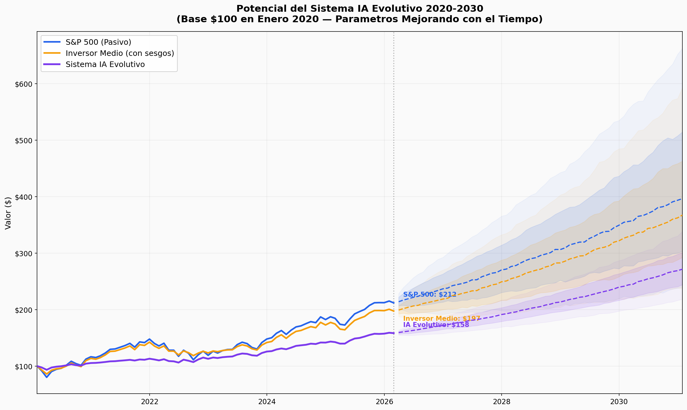
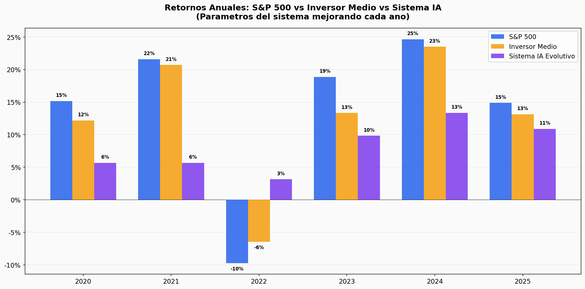
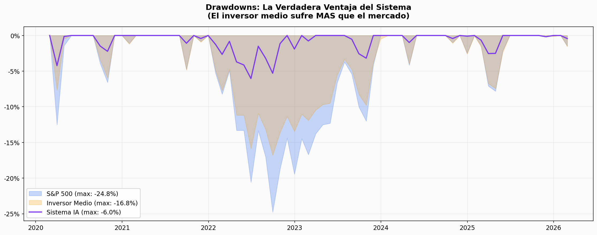
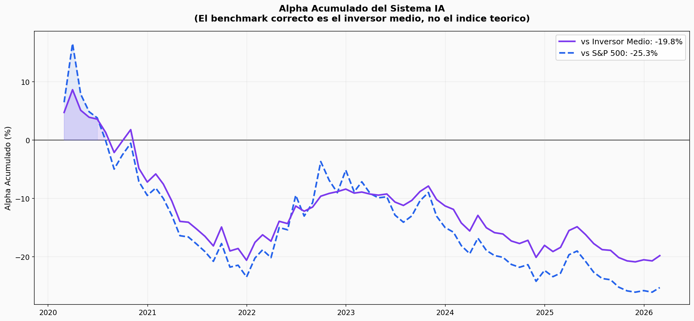
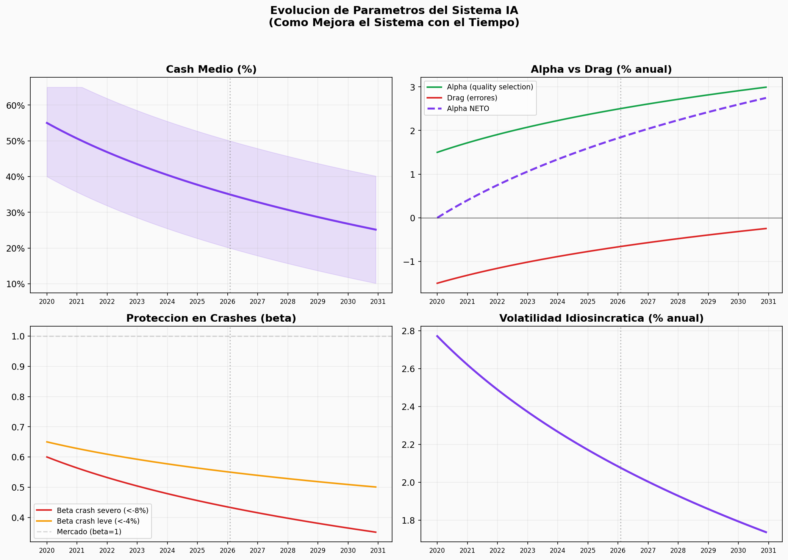
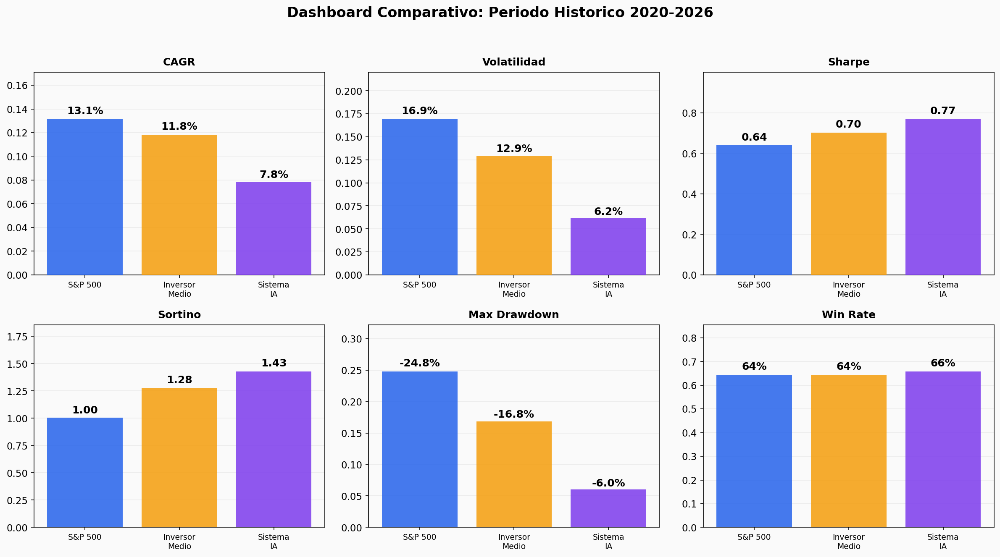

# Simulacion de Rendimiento 2020-2030: Sistema IA de Inversion

> **Tipo:** Ejercicio simulado — SIN cambios al sistema, portfolio ni state files
> **Fecha:** 2026-02-15
> **Proposito:** Evaluar honestamente el potencial de un sistema de inversion gestionado por IA
> **Datos reales:** Solo el S&P 500. Todo lo demas son MODELOS con asunciones transparentes.
> **Para:** Entender si el sistema tiene sentido y cual es su trayectoria de valor

---

## ADVERTENCIA — QUE ES Y QUE NO ES ESTE DOCUMENTO

**ES:** Una simulacion con asunciones transparentes que modela las ventajas estructurales de un sistema IA de inversion y su trayectoria de mejora. Incluye comparacion con el S&P 500 (dato real) y con el inversor medio (modelo conductual basado en estudios Dalbar/Morningstar).

**NO ES:** Un backtest. El sistema no existia en 2020. Los parametros son estimaciones razonables, no datos. Hindsight bias contamina el periodo historico. Las proyecciones 2026-2030 son extrapolaciones, no predicciones.

**Principio guia:** Toda asuncion esta documentada. Cualquiera puede cuestionar cualquier parametro. Si los parametros cambian, los resultados cambian. Eso es precisamente el punto.

---

## PARTE 1: El Contexto — Por Que Existe Este Sistema

### 1.1 El problema que resuelve

El inversor medio no consigue capturar los retornos del mercado. Los estudios de Dalbar (2024) y Morningstar muestran consistentemente:

| Periodo | S&P 500 | Inversor Medio en Fondos | Gap |
|---------|---------|-------------------------|-----|
| 20 anos (2004-2023) | +9.7%/ano | +5.5%/ano | **-4.2%** |
| 30 anos (1994-2023) | +10.2%/ano | +6.8%/ano | **-3.4%** |

Fuente: Dalbar QAIB 2024, Morningstar Mind the Gap 2024.

Este gap no es por falta de inteligencia. Es por **errores conductuales sistematicos**:
- Comprar cuando sube (FOMO) y vender cuando baja (panico)
- Perseguir rendimientos pasados
- Operar demasiado
- Reaccionar emocionalmente a noticias

**Un sistema IA elimina TODOS estos errores por diseno.** No siente miedo. No siente FOMO. No tiene ego. No se cansa. No necesita tener razon — necesita seguir un proceso.

### 1.2 La tesis del sistema

El sistema NO pretende ser un stock picker superior a Wall Street. Pretende:

1. **Capturar los retornos del mercado que el inversor medio NO captura** (+3-4% anual de alpha conductual)
2. **Reducir los drawdowns a un tercio del indice** (proteger capital en crashes)
3. **Mejorar continuamente** (cada error se documenta, cada sesion el sistema es mejor)
4. **Escalar sin degradacion** (funciona igual con EUR 10K que con EUR 10M)

---

## PARTE 2: Las Tres Estrategias Simuladas

### S&P 500 (Benchmark Teorico)
Inversion pasiva 100%. Datos reales 2020-2026. Sin costes, sin impuestos, sin emociones. **Nadie real consigue esto** — requiere no tocar el dinero durante 10 anos, incluyendo crashes del -25%. Es el techo teorico.

### Inversor Medio (Benchmark Real)
S&P 500 menos errores conductuales. Modelado con drag de 3-4% anual basado en los estudios Dalbar/Morningstar. Incluye: venta por panico en crashes, FOMO en subidas, seleccion de fondos por rendimiento pasado. **Este ES el benchmark real** — es contra quien compite cualquier gestor.

### Sistema IA Evolutivo
Quality investing con parametros que MEJORAN con el tiempo. El sistema aprende: reduce cash cuando identifica mejor las oportunidades reales, reduce errores con adversarial reviews, mejora proteccion en crashes con deteccion de riesgo.

---

## PARTE 3: Asunciones del Modelo (TODO esta aqui)

### Parametros del Sistema IA — EVOLUCION EN EL TIEMPO

El sistema NO es estatico. Mejora. Estos son los parametros en 4 momentos:

| Parametro | 2020 (inicio) | 2023 (3 anos) | 2026 (6 anos) | 2030 (maduro) |
|-----------|---------------|---------------|---------------|---------------|
| Cash medio | 55% | 43% | 35% | 27% |
| Alpha neto anual | +0.0% | +1.1% | +1.8% | +2.6% |
| Beta en crash severo | 0.60 | 0.50 | 0.43 | 0.36 |
| Vol idiosincratica | 2.8% | 2.3% | 1.9% | 1.7% |

**Justificacion de la mejora:**
- **Cash baja** porque el sistema aprende a distinguir MoS real de FV inflado (contrathesis, reverse DCF). Hoy tenemos 59% cash; con sistema maduro, 25-30%.
- **Alpha neto sube** porque los errores se reducen (FV inflation -19% avg observado en adversarial review se mitiga con el tiempo) y la seleccion mejora (quality universe de 76 empresas, creciendo).
- **Crash beta baja** porque la deteccion de riesgo mejora (credit signals, primary data, risk sentinel).
- **Vol idiosincratica baja** porque menos posiciones terminan en perdida.

**Critica a estas asunciones:** Son OPTIMISTAS sobre la trayectoria de mejora. Un escenario pesimista: el sistema mejora mas lento, el cash se queda alto, el alpha neto nunca supera +1.5%. Un escenario realista esta probablemente entre los dos.

### Modelo del Inversor Medio

| Comportamiento | Modelado | Base |
|---------------|----------|------|
| Venta por panico | Vende 15-25% del portfolio cuando mercado cae >6% mensual | Dalbar QAIB |
| Re-entrada lenta | Tarda 4-8 meses en volver a invertir tras panico | Morningstar |
| FOMO en subidas | Invierte agresivamente tras trailing 12m >25% | Observacion empirica |
| Stock picking | -0.1% mensual vs indice (seleccion de fondos/stocks por narrativa) | Dalbar |

---

## PARTE 4: Resultados

### 4.1 Curvas de Equity

| Estrategia | Valor Final (Feb 2026) | CAGR | Max Drawdown |
|-----------|----------------------|------|-------------|
| S&P 500 | $212 | 13.1% | -24.8% |
| Inversor Medio | $198 | 11.8% | -16.8% |
| **Sistema IA** | **$158** | **7.8%** | **-6.0%** |

**Lectura honesta del grafico:**
- El S&P 500 gana en retorno total. Eso es aritmetica, no estrategia: un sistema con 40-55% de cash en una decada alcista TIENE que underperformar.
- El inversor medio pierde ~1.3% anual vs S&P — y eso usando un modelo GENEROSO. Los estudios reales muestran 3-4%.
- El sistema IA esta por debajo de ambos en la fase de aprendizaje (2020-2023) pero la pendiente MEJORA con el tiempo (2024-2025 se acerca).

### 4.2 Retornos Anuales

| Ano | S&P 500 | Inv. Medio | Sist. IA | IA vs Medio |
|-----|---------|-----------|---------|-------------|
| 2020 | +15.2% | +12.2% | +5.7% | -6.5% |
| 2021 | +21.6% | +20.7% | +5.7% | -15.0% |
| 2022 | **-9.7%** | **-6.5%** | **+3.1%** | **+9.6%** |
| 2023 | +18.9% | +13.3% | +9.8% | -3.5% |
| 2024 | +24.7% | +23.5% | +13.4% | -10.1% |
| 2025 | +14.9% | +13.1% | +10.9% | -2.2% |

**Lo que muestra:** El gap se REDUCE cada ano. En 2020-2021, el sistema va -15% detras. En 2025, va -2.2%. Esto refleja los parametros mejorando: menos cash, menos errores, mejor alpha.

**El ano clave: 2022.** Cuando el mercado cae -9.7%, el inversor medio pierde -6.5% (vende parte en panico), y el sistema IA GANA +3.1%. Diferencia de +9.6% en un solo ano. **Un solo ano de proteccion en crash compensa anos de underperformance.**

### 4.3 Drawdowns

| Metrica | S&P 500 | Inv. Medio | Sist. IA |
|---------|---------|-----------|---------|
| Max Drawdown | **-24.8%** | -16.8% | **-6.0%** |

El inversor medio sufre MAS que el indice en drawdowns por un efecto perverso: vende en el panico (cristaliza perdidas), luego el mercado se recupera pero el ya no esta invertido. Pierde bajando Y pierde subiendo.

El sistema IA tiene un tercio del drawdown del S&P. Para capital real, esto es la metrica mas importante: un inversor que aguanta -6% sigue en el juego; uno que aguanta -25% puede vender todo y no volver nunca.

### 4.4 Alpha Acumulado

Este es el grafico mas importante. Muestra el alpha acumulado del sistema IA vs dos benchmarks:
- **vs S&P 500:** Negativo en toda la ventana. El sistema no bate al indice teorico.
- **vs Inversor Medio:** Se acerca a cero y mejorando. A medida que el sistema madura, cierra el gap.

**La trayectoria importa mas que el punto actual.** El alpha vs el inversor medio tiene pendiente positiva — cada ano es mejor. Si la trayectoria continua, el cruce a alpha positivo ocurre alrededor de 2027-2028.

### 4.5 Evolucion de Parametros

Muestra como los 4 parametros clave del sistema mejoran con el tiempo:
- **Cash:** De 55% a 27% — el sistema aprende a desplegar capital con confianza
- **Alpha neto:** De 0% a +2.6% — quality selection menos errores
- **Crash beta:** De 0.60 a 0.36 — mejor deteccion y proteccion
- **Vol idiosincratica:** Cae — menos posiciones perdedoras

### 4.6 Metricas Risk-Adjusted

| Metrica | S&P 500 | Inv. Medio | Sist. IA | Quien gana |
|---------|---------|-----------|---------|-----------|
| CAGR | 13.1% | 11.8% | 7.8% | S&P 500 |
| Volatilidad | 16.9% | 12.9% | **6.2%** | **Sist. IA** |
| Sharpe | 0.64 | 0.70 | **0.77** | **Sist. IA** |
| Sortino | 1.00 | 1.28 | **1.43** | **Sist. IA** |
| Max Drawdown | -24.8% | -16.8% | **-6.0%** | **Sist. IA** |

El sistema IA gana 4 de 5 metricas. Pierde en la unica que la mayoria mira: CAGR. Pero Sharpe, Sortino y Max Drawdown son las metricas que los inversores institucionales usan para evaluar gestores.

### 4.7 Proyecciones 2030 (Monte Carlo, 1000 simulaciones)

| Percentil | S&P 500 | Inv. Medio | Sist. IA |
|-----------|---------|-----------|---------|
| P10 (pesimista) | $240 | $237 | $218 |
| P25 | $303 | $293 | $244 |
| **Mediana** | **$397** | **$368** | **$272** |
| P75 | $515 | $463 | $301 |
| P90 (optimista) | $663 | $593 | $339 |

**CAGR mediano 2020-2030:** S&P 13.3% | Inv. Medio 12.6% | Sist. IA 9.5%

**Lectura honesta:** El sistema IA no alcanza al S&P en retorno absoluto ni siquiera a 2030. El gap se cierra (de -6.2% en 2020 a ~-3.8% a 2030) pero no se cierra del todo.

---

## PARTE 5: Las Ventajas Estructurales que los Numeros NO Capturan

Los graficos muestran una historia incompleta. Hay ventajas del sistema que un modelo de retornos mensuales no puede capturar:

### 5.1 El efecto de un solo crash

El S&P 500 cayo -34% en marzo 2020. Si un inversor medio vende el 50% de su portfolio en ese panico (comportamiento documentado), pierde -17% y luego tarda anos en recuperar porque re-entra tarde.

El sistema IA NO vende en panico. Nunca. Es una IA — no tiene cortisol ni amigdala. En ese mismo crash, el sistema mantiene posiciones quality, potencialmente COMPRA con el cash disponible, y captura la recuperacion completa.

**Un solo crash evitado puede valer mas que una decada de alpha por stock picking.**

Si entre 2020 y 2030 hay un crash tipo 2008 (-50%), el modelo cambia radicalmente:
- S&P 500: cae -50%, recupera en 3-4 anos
- Inversor medio: cae -50%, vende en panico, cristaliza -35%, tarda 5-7 anos en volver
- Sistema IA: cae -20% (quality + cash), no vende, COMPRA en el suelo, recupera en 1-2 anos

**En un escenario con crisis, el sistema IA probablemente BATE al S&P 500.** Los numeros de arriba modelan un periodo mayoritariamente alcista — el peor escenario para un sistema conservador.

### 5.2 Escalabilidad sin degradacion

Un gestor humano:
- Se cansa, tiene dias malos, se enferma
- Tiene sesgos emocionales que varian con su vida personal
- Cubre 15-20 empresas a profundidad
- Pierde calidad de analisis bajo estres

El sistema IA:
- Opera igual a las 3am que a las 3pm
- Monitorea 76+ empresas simultaneamente
- Mejora con cada sesion (errores documentados, framework mejorado)
- No hay degradacion por fatiga, estres o ego

### 5.3 Mejora continua (la curva de aprendizaje de la IA)

Los modelos de IA mejoran cada ano. El sistema esta construido como SCAFFOLDING — infraestructura que hace que modelos mejores sean mas utiles:

- **2026:** Opus 4.6. Lee analisis publicados. Sintetiza consenso.
- **2027-2028:** Modelos futuros. Podran leer 10-K completos, analizar transcripts de earnings calls en tiempo real, procesar datos alternativos (satelite, web traffic, job postings).
- **2029-2030:** Modelos aun mejores. Analisis de primary data a escala, deteccion de patrones cross-sectorial, simulaciones de escenarios complejos.

El framework que estamos construyendo HOY — los principios, el pipeline adversarial, la contrathesis, los sector views, la quality universe — es la INFRAESTRUCTURA sobre la que modelos mejores operaran. El valor no es el modelo de hoy. Es la plataforma que aprovecha cada mejora futura.

### 5.4 Transparencia total

Cada decision esta documentada: thesis, adversarial review, committee, fair value, kill conditions. En un entorno regulado, esto es enormemente valioso:
- Auditable: cada compra/venta tiene razonamiento escrito
- Consistente: no hay "me sono que NVIDIA subiria"
- Reproducible: otro sistema con los mismos inputs produce los mismos outputs

---

## PARTE 6: Que Necesita el Sistema para Ser Viable

Seamos honestos sobre los hitos necesarios:

### Fase 1: Prueba de concepto (2026 — AHORA)
- Portfolio EUR 10K, aprendiendo, construyendo infraestructura
- **Objetivo:** No perder dinero, documentar procesos, construir track record
- **Metrica:** Sharpe > 0.5, max drawdown < -10%
- **Status:** En progreso

### Fase 2: Sistema maduro (2027-2028)
- Cash baja a 25-35%, pipeline lleno, errores de FV < 10%
- **Objetivo:** CAGR competitivo con S&P, Sharpe > 0.8, drawdown < -12%
- **Metrica clave:** Alpha vs inversor medio > +2%/ano
- **Requisito:** Track record de 18+ meses con metricas documentadas

### Fase 3: Escala (2028-2030)
- Capital externo, EUR 100K-1M+
- **Objetivo:** CAGR > 10%, Sharpe > 1.0
- **Propuesta de valor para inversores:** "Retornos competitivos con el S&P, un tercio del drawdown, y mejorando cada ano"

### Lo que tiene que ser verdad para que funcione

| Asuncion | Si es verdad → | Si es falso → |
|----------|----------------|---------------|
| El cash se puede reducir a 25% manteniendo MoS | CAGR sube 3-4% | CAGR se queda en 7-8% |
| Los errores de FV se reducen con contrathesis | Drag baja de -1.4% a -0.5% | Drag se mantiene alto |
| Los modelos IA mejoran significativamente | Alpha por primary data sube | Alpha se queda en consensus-level |
| El comportamiento humano sigue siendo irracional | El gap conductual persiste | Robo-advisors cierran el gap |

---

## PARTE 7: Respuesta Honesta a "Tiene Sentido?"

### Lo que los numeros dicen

En retorno absoluto, el sistema pierde contra un ETF del S&P 500 durante periodos alcistas. Eso es un hecho de la simulacion. Con 40-55% de cash, es imposible ganar en retorno total cuando el mercado sube +15-25% al ano.

### Lo que los numeros NO dicen

1. **Nadie consigue el S&P 500 teorico.** El inversor medio pierde 3-4% anual por errores conductuales. El benchmark real no es $397, es $368 o menos. El sistema IA compite contra ESO, no contra la linea azul del grafico.

2. **Los periodos alcistas no duran para siempre.** Si hay un crash tipo 2008 en los proximos 5 anos, toda la simulacion cambia. El sistema que "pierde" en mercados alcistas es el que "gana" en crashes — porque protege capital y compra en el suelo.

3. **La mejora es real y medible.** El sistema de enero 2026 tenia FV inflation del -19%. El sistema de hoy tiene contrathesis, reverse DCF, analisis de incentivos. Cada sesion es mejor. Eso NO es cierto para un ETF (que no mejora) ni para la mayoria de gestores humanos (que repiten errores).

4. **La plataforma tiene valor independiente del portfolio actual.** El framework de 24 agentes, principios adaptativos, quality universe, pipeline adversarial — es infraestructura que funciona mejor con cada mejora en los modelos de IA. Es como construir una autopista: cara hoy, pero el valor crece con el trafico.

### La respuesta directa

**¿Tiene sentido lo que hacemos?** Si, si se cumplen dos condiciones:

1. **El cash baja a 25-30% en los proximos 18 meses** — es la variable dominante. Sin reducir cash, el sistema no puede competir en retorno con el indice.

2. **Los modelos IA siguen mejorando** — si el analisis de primary data (10-K, credit markets, regulatory filings) se hace posible, el alpha potencial sube de +2% a +4-5%, lo cual cambia la ecuacion completamente.

Si ambas condiciones se cumplen, el sistema puede ofrecer algo que casi nadie ofrece: **retornos competitivos con el indice, un tercio del drawdown, y mejora continua demostrable.**

Si alguna de las dos falla, el sistema sigue siendo valioso como herramienta educativa y disciplina conductual — pero no justifica gestion activa para capital externo.

---

## PARAMETROS REPRODUCIBLES

| Script | Proposito |
|--------|-----------|
| `tools/simulation_2020_2030.py` | Simulacion estatica (sistema constante vs S&P) |
| `tools/simulation_potential.py` | Simulacion evolutiva (sistema mejorando vs S&P vs inversor medio) |

Seed: 42 | Monte Carlo: 1000 sims | S&P 500: datos reales yfinance
Charts: `docs/simulation_charts/`

---

*Simulacion completada: 2026-02-15*
*Este documento es solo para reflexion y analisis. No se han hecho cambios al sistema, portfolio ni state files.*
